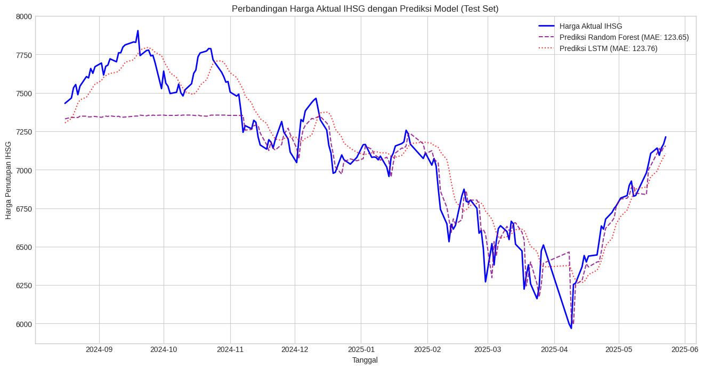

# Prediksi Harga Penutupan IHSG menggunakan Machine Learning

[](https://www.python.org/downloads/)
[](https://www.tensorflow.org/)
[](https://scikit-learn.org/)
[](https://opensource.org/licenses/MIT)

Proyek ini bertujuan untuk mengembangkan dan membandingkan model _machine learning_ untuk memprediksi harga penutupan Indeks Harga Saham Gabungan (IHSG). Dua pendekatan utama dieksplorasi: **Random Forest Regressor** sebagai model _machine learning_ klasik dan **Long Short-Term Memory (LSTM)** sebagai model _deep learning_ untuk data deret waktu.



_(Catatan: Pastikan file `gambar.png` berada di dalam repositori Anda agar gambar ini dapat ditampilkan.)_

## 📜 Deskripsi Proyek

Indeks Harga Saham Gabungan (IHSG) adalah barometer utama kinerja pasar saham di Indonesia. Kemampuan untuk memprediksi pergerakannya secara akurat sangat berharga bagi investor untuk membuat keputusan investasi dan mengelola risiko. Proyek ini mengatasi tantangan tersebut dengan:

- Menggunakan data historis IHSG selama 5 tahun terakhir.
- Melakukan pra-pemrosesan data untuk menangani format angka dan tanggal.
- Menerapkan dua model prediksi yang berbeda untuk menangkap pola dari data.
- Mengevaluasi dan membandingkan performa kedua model menggunakan metrik standar (MAE dan RMSE).

## 🛠️ Teknologi yang Digunakan

- **Analisis Data**: [Pandas](https://pandas.pydata.org/), [NumPy](https://numpy.org/)
- **Visualisasi Data**: [Matplotlib](https://matplotlib.org/), [Seaborn](https://seaborn.pydata.org/)
- **Machine Learning**: [Scikit-learn](https://scikit-learn.org/) (untuk Random Forest & Preprocessing)
- **Deep Learning**: [TensorFlow (Keras)](https://www.tensorflow.org/) (untuk LSTM)
- **Lingkungan Kerja**: [Jupyter Notebook](https://jupyter.org/)

## 📁 Struktur Proyek

```
.
├── 📂 IHSG_5_Tahun.csv       # Dataset historis IHSG
│
├── 🖼️ gambar.png             # Gambar hasil plot prediksi
│
├── 📓 Laporan.md             # Laporan detail analisis proyek
│
├── 🐍 Model.ipynb            # Notebook utama untuk preprocessing dan pemodelan
│
└── 📜 README.md              # File ini yang sedang Anda baca
```

## ⚙️ Alur Kerja Proyek

1.  **Pemuatan & Pembersihan Data**: Data dari `IHSG_5_Tahun.csv` dimuat. Dilakukan pembersihan pada kolom numerik untuk mengubah format (misal: dari '1.234,56' menjadi 1234.56) dan mengonversi kolom tanggal.
2.  **Pra-pemrosesan & Feature Engineering**: Data diurutkan berdasarkan tanggal. Untuk model LSTM, data harga penutupan dinormalisasi menggunakan `MinMaxScaler`.
3.  **Pelatihan Model**:
    - **Random Forest**: Dilatih menggunakan data historis sebagai fitur untuk memprediksi harga penutupan di masa depan.
    - **LSTM**: Dilatih sebagai model sekuensial untuk mempelajari pola deret waktu dari data harga penutupan.
4.  **Evaluasi Model**: Kedua model dievaluasi pada data uji yang sama menggunakan metrik _Mean Absolute Error_ (MAE) dan _Root Mean Squared Error_ (RMSE) untuk membandingkan akurasinya.

## 📈 Hasil

Perbandingan performa antara model Random Forest dan LSTM pada data uji menunjukkan hasil yang kompetitif.

| Model             | MAE (Mean Absolute Error) | RMSE (Root Mean Squared Error) |
| ----------------- | :-----------------------: | :----------------------------: |
| **Random Forest** |        **121.35**         |             181.67             |
| **LSTM**          |          123.76           |           **174.55**           |

**Kesimpulan Analisis:**

- **Random Forest** memiliki **MAE lebih rendah**, menunjukkan bahwa secara rata-rata, prediksinya lebih mendekati nilai aktual. Model ini terbukti lebih stabil dalam menangkap tren harga secara keseluruhan.
- **LSTM** memiliki **RMSE lebih rendah**, mengindikasikan bahwa model ini lebih baik dalam menghindari kesalahan prediksi yang sangat besar.
- Secara keseluruhan, kedua model memiliki rata-rata error prediksi di bawah **2%** dari rata-rata harga IHSG, yang merupakan hasil sangat baik dan menjanjikan.

## 🚀 Cara Menjalankan

Untuk menjalankan proyek ini di mesin lokal Anda, ikuti langkah-langkah berikut.

### 1. Prasyarat

Pastikan Anda memiliki Python (versi 3.9 atau lebih baru) dan `pip` terinstal.

### 2. Instalasi

1.  **Clone repositori ini:**

    ```sh
    git clone [https://github.com/DianPandus/forecast_IHSG.git](https://github.com/DianPandus/forecast_IHSG.git)
    cd forecast_IHSG
    ```

2.  **Buat dan aktifkan _virtual environment_ (sangat disarankan):**

    ```sh
    python -m venv venv
    source venv/bin/activate  # Untuk Windows: venv\Scripts\activate
    ```

3.  **Instal pustaka yang diperlukan:**
    _(Disarankan untuk membuat file `requirements.txt` dari notebook, namun untuk saat ini, Anda bisa instal secara manual)_
    ```sh
    pip install pandas numpy matplotlib seaborn scikit-learn tensorflow
    ```

### 3. Penggunaan

Buka dan jalankan semua sel di dalam notebook `Model.ipynb` menggunakan Jupyter Notebook atau VS Code. Pastikan file dataset `IHSG_5_Tahun.csv` berada di direktori yang sama atau sesuai dengan path yang ditentukan di dalam notebook.
